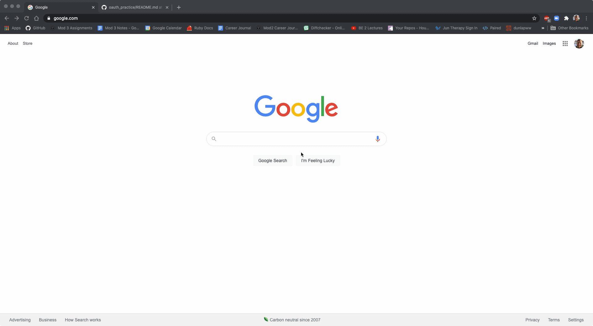

## OAuth Workshop
This simple app demonstrates the functionalty of GitHub Oauth.  A visitor can login on the welcome page by clicking the login button which redirects them to the GitHub OAuth site.  If the visitor approves logging in with their github credentials, the visitor permits this app to see the visitors public and private repositories.  Once the visitor clicks authorize GitHub access, they are redirected their dashboard which displays a list of their public and private repos.

##Install
1. clone this directory to your local machine
2. $rails db:create
3. $rails server
4. open web browser and navigate to localhost:3000

##Demo

